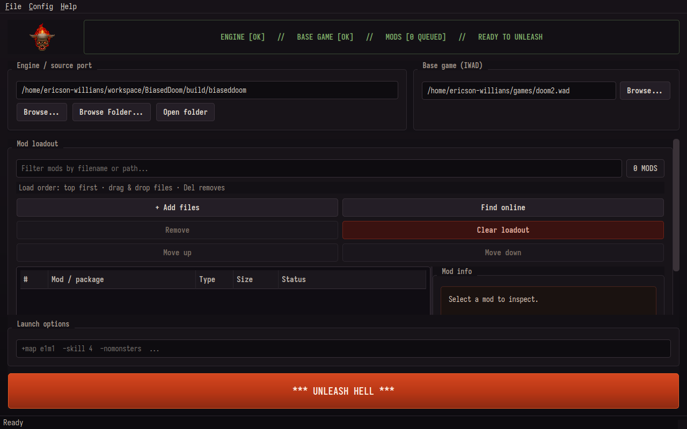

# BFG.py



**BFG.py** is a cross-platform Doom launcher and mod manager with a deliberately
chunky 1990s DOS interface. It combines source-port and IWAD setup, ordered mod
loadouts, a managed local library, idgames discovery, preserved download
metadata, and deterministic launch validation in one desktop application.

| | |
| --- | --- |
| Current version | `3.0.0` |
| Platforms | Windows, Linux, macOS |
| Python | 3.9 or newer |
| UI toolkit | PyQt5 |
| Package | `bfg-py` |
| License | MIT |

> BFG.py does not include Doom, an IWAD, or a source port. You must provide
> legally obtained game data and install a compatible source port such as
> GZDoom separately.

## Contents

- [Highlights](#highlights)
- [Requirements](#requirements)
- [Quick start](#quick-start)
- [First launch](#first-launch)
- [Using the mod loadout](#using-the-mod-loadout)
- [Finding and downloading mods](#finding-and-downloading-mods)
- [Managed library and metadata](#managed-library-and-metadata)
- [Source management](#source-management)
- [Download and launch safety](#download-and-launch-safety)
- [Keyboard shortcuts](#keyboard-shortcuts)
- [Command-line interface](#command-line-interface)
- [Configuration](#configuration)
- [Project structure](#project-structure)
- [Development and verification](#development-and-verification)
- [Troubleshooting](#troubleshooting)
- [License and trademarks](#license-and-trademarks)

## Highlights

### Mission-control launch workflow

- A live readiness strip reports engine, base-game, mod, and missing-file state.
- Source-port discovery recognizes common executables and validates the selected
  launch target before starting it.
- IWAD detection searches configured and nearby game directories.
- The launch command is assembled deterministically and shown in the log.
- Source-port output, failures, exit status, and elapsed time remain visible.

### Ordered mod loadouts

- Add `.wad`, `.pk3`, `.ipk3`, `.pk7`, `.pke`, and `.zip` files.
- Drag files from the desktop directly into the loadout.
- Reorder entries by dragging them or using the move controls.
- See the exact top-to-bottom load order, file type, size, and health.
- Filter large loadouts without changing their launch order.
- Missing files are called out before launch.

### Full-window mod discovery

- Search multiple idgames and community archive mirrors.
- Search filenames, titles, descriptions, authors, themes, and remote paths.
- Select useful results immediately while slower sources continue working.
- Preserve the current selection as more mirrors return results.
- Download a result only, or download and queue it in a single action.
- Cancel a long-running search without allowing late results to corrupt the UI.
- Expand the browser into the complete application workspace and return to the
  launch setup with one button.

### Managed local library

- Keep downloaded files in a configurable library directory.
- Filter the library by filename, title, description, source, or remote path.
- Queue existing library files without downloading them again.
- Reuse an existing download by source identity instead of creating duplicates.
- Open a file, its folder, or the complete library from the application.
- Remove managed files with an explicit confirmation step.

### Detailed metadata

- Show WAD type, lump count, detected map names, and initial lump names.
- Show PK3/ZIP entry counts, detected maps, and representative contents.
- Display size, modification time, local path, and missing-file state.
- Preserve idgames title, source, remote path, description, and download date.
- Cache expensive local inspection results without blocking the UI.

### Readable 90s presentation

- Retains the navy, gold, blood-red, monospace DOS aesthetic.
- Uses explicit high-contrast colors for normal, alternating, hovered, selected,
  inactive, and disabled rows.
- Automatically prioritizes core controls in shorter windows.
- Pauses decorative animation when the browser needs the available space.

## Requirements

You need:

1. Python 3.9 or newer.
2. [`uv`](https://docs.astral.sh/uv/) for the recommended installation flow.
3. A Doom source port, normally GZDoom or another executable that accepts
   `-iwad` and `-file` arguments.
4. At least one legally obtained IWAD, such as `doom.wad`, `doom2.wad`,
   `plutonia.wad`, or `tnt.wad`.
5. Internet access only if you want to search or download from remote sources.

## Quick start

Clone the repository and install its locked dependencies:

```bash
git clone https://github.com/EricsonWillians/BFG.py.git
cd BFG.py
uv sync
```

Start the graphical launcher:

```bash
uv run bfg
```

These entry points are equivalent when run from the repository root:

```bash
uv run python -m bfg
uv run python main.py
```

To install with standard `pip` instead:

```bash
python -m venv .venv
source .venv/bin/activate  # Windows PowerShell: .venv\Scripts\Activate.ps1
python -m pip install -r requirements.txt
python -m bfg
```

Running from the repository root ensures that the bundled theme and image
assets are available.

## First launch

The main screen is organized as a four-stage launch checklist.

### 1. Engine / source port

Select the executable for your source port. You may choose the file directly,
select its containing folder, or enter a command already available on `PATH`,
such as `gzdoom`.

On Linux and macOS, a selected binary must have its executable permission set.
On macOS, `.app` bundles are resolved to their executable when possible.

### 2. Base game / IWAD

Choose the IWAD that supplies the base game. BFG.py attempts to detect an IWAD
near the source port and in configured game directories when the current path
is empty or invalid.

### 3. Mod loadout

Add local files or select **Find Online**. Mods at the top of the list are passed
to the source port first; mods lower in the list may override resources loaded
earlier, depending on the source port and the mod.

### 4. Launch options

Enter any additional source-port arguments, for example:

```text
-skill 4 -warp 01 -nomusic
```

The arguments are parsed using platform-appropriate shell rules and appended
after the IWAD and mod arguments.

When the readiness strip reports **READY TO UNLEASH**, select
**UNLEASH HELL**. Invalid paths remain blocked by launch validation even if the
button is pressed.

## Using the mod loadout

The loadout is the ordered set of files passed to the source port through its
`-file` argument.

| Control | Behavior |
| --- | --- |
| **Add Files** | Opens a multi-file picker for supported Doom mod formats. |
| **Find Online** | Opens and expands the remote mod browser. |
| **Remove** | Removes selected entries from this launch only. |
| **Clear Loadout** | Removes every queued entry after confirmation; library files remain on disk. |
| **Move Up / Move Down** | Changes the selected entries' launch priority. |
| Drag rows | Reorders the loadout directly. |
| Drag local files into the list | Adds supported files to the loadout. |
| `Delete` | Removes selected loadout entries. |

The status column distinguishes launch-ready files from missing paths. Filtering
the list changes only what is visible; it never changes the stored order.

## Finding and downloading mods

Select **Find Online** or press `Ctrl+B` to open the online terminal. Starting a
search automatically expands the browser so results, metadata, and controls do
not compete with the launch form for screen space.

### Search workflow

1. Choose **All active sources** or a specific mirror.
2. Search by filename, title, author, description, theme, or path.
3. Select a result row. The first available result is selected automatically.
4. Review its source, size, archive path, and description in the metadata pane.
5. Choose one of the install actions:

| Action | Result |
| --- | --- |
| **Download + Queue** | Downloads the selection when needed and adds it to the current loadout. |
| **Download Only** | Stores the selection in the library without changing the loadout. |
| **Download + Queue All** | Installs every visible result and queues it in displayed order. |
| **Download All** | Stores every visible result without queueing it. |
| **View Details** | Opens the complete preserved result metadata. |
| **Open Page** | Opens the selected result's upstream page in the system browser. |

Results arrive incrementally. The result table remains interactive while other
mirrors are still searching, and selected rows remain selected when a later
source contributes more matches. During an active search, **Reset** becomes
**Cancel Search**.

Double-clicking a result is a shortcut for **Download + Queue**. Batch controls
are hidden automatically in compact layouts but remain available in the
expanded browser.

### Search behavior

BFG.py prefers exact metadata matches, then progressively considers filename,
path, token, and relaxed matches. It can fall back to other enabled idgames
mirrors when the preferred source returns no result. Search feedback reports
elapsed time, sources completed, index entries scanned, matches, and source
errors.

Index data is cached for faster repeat browsing. Source health and cache state
are visible in the Sources tab.

## Managed library and metadata

The Library tab represents files stored in the configured mod-library directory.
It is separate from the current loadout: a file may exist in the library without
being queued for the next launch.

For every browser-managed download, BFG.py writes a sidecar file next to the
package:

```text
sunlust.zip
sunlust.zip.bfg-meta.json
```

The sidecar records:

- display title and description;
- source ID and source name;
- upstream archive path;
- download and browser URLs;
- download timestamp;
- reported remote size.

This provenance is shown in the library and in the loadout's **Mod
Intelligence** pane. Deleting a managed library item also removes its sidecar.
Removing an item from the loadout does not delete either file.

When the same source and remote archive are requested again, BFG.py reuses the
existing managed file. Files with colliding names but different identities are
given safe, source-qualified names instead of being overwritten.

### Supported library formats

| Extension | Typical use |
| --- | --- |
| `.wad` | Classic PWAD or compatible WAD data. |
| `.pk3` | ZIP-based source-port mod package. |
| `.ipk3` | Standalone or IWAD-like ZIP package supported by some ports. |
| `.pk7` | Source-port package convention. |
| `.pke` | Source-port package convention. |
| `.zip` | Download archive or directly loadable ZIP package. |

Whether a package can be launched directly ultimately depends on the selected
source port.

## Source management

The Sources tab is a scrollable administration workspace split into three
sections.

### Search priority and health

- Drag sources or use the move controls to set search priority.
- Enable or disable individual sources.
- Enable or disable all configured sources.
- Remove custom or discovered sources.
- Purge unavailable custom sources.
- Inspect cached, reachable, unreachable, disabled, and unknown health states.

Built-in sources are restored when needed so a malformed configuration cannot
permanently leave the browser without a usable default.

### Discover mirrors

Use **Discover Doomworld Mirrors** to look for current idgames mirrors. The seed
field is optional; when it is empty, BFG.py uses its built-in discovery pages.
Discovered sources are de-duplicated by normalized base URL.

### Custom sources

The simple form accepts a URL by itself. Advanced entries use this shape:

```text
URL | Display name | index path | parser
```

Supported parser names include `fullsort`, `idgames_api`, `html`, `json`,
`rss`, `text`, and `auto`.

## Download and launch safety

BFG.py treats network and process boundaries defensively.

- Downloads stream to a temporary `.part` file.
- Empty responses are rejected.
- `.wad` downloads must begin with an `IWAD` or `PWAD` signature.
- ZIP-based formats must pass ZIP integrity recognition.
- Only a validated temporary file is atomically moved into the library.
- Failed batches retain the failed result set for a targeted retry.
- Metadata sidecars are written through a temporary file and atomically replaced.
- Existing source identities are reused rather than downloaded repeatedly.
- Library deletion requires confirmation and never silently removes a loadout.
- Launch targets, IWADs, and queued mod paths are validated before process start.
- Source-port startup is bounded by a timeout and tracked through explicit states.
- Configuration saves are normalized, atomic, and backed up.

Remote archives are maintained by third parties. BFG.py validates the container
format, not the quality or trustworthiness of mod contents. Review unfamiliar
downloads and use reputable sources.

## Keyboard shortcuts

| Shortcut | Action |
| --- | --- |
| `Ctrl+O` | Select a source-port executable. |
| `Ctrl+I` | Select an IWAD. |
| `Ctrl+P` | Add local PWAD/package files. |
| `Ctrl+B` | Show or hide the mod browser. |
| `Ctrl+Shift+B` | Open Doomworld idgames in the system browser. |
| `Ctrl+Q` | Exit BFG.py. |
| `Enter` in the engine, IWAD, or options field | Request a launch. |
| `Delete` in the loadout | Remove selected loadout entries. |

## Command-line interface

The GUI and headless utilities share the same configuration model.

```text
usage: BFG.py [options]

--config PATH             Use a specific configuration file.
--performance-test        Run the performance smoke test.
--no-animations           Disable decorative animation and use the low profile.
--source-port PATH        Override the configured source-port executable.
--iwad PATH               Override the configured IWAD.
--pwad-dir PATH           Override the managed mod-library directory.
--pwad PATH               Add a mod path; may be repeated.
--extra-options TEXT      Append source-port command-line arguments.
--exit-after-launch       Use deterministic teardown in headless mode.
--check-config            Validate configuration and exit.
--test-config             Validate configuration without opening the GUI.
--no-gui                  Run the launch flow without the GUI.
--version                 Print the BFG.py version.
```

### Examples

Inspect the version and configuration:

```bash
uv run bfg --version
uv run bfg --check-config
```

Start the GUI with explicit paths:

```bash
uv run bfg \
  --source-port /usr/games/gzdoom \
  --iwad /games/doom/doom2.wad \
  --pwad-dir /games/doom/mods \
  --pwad /games/doom/mods/sunlust.zip \
  --extra-options "-skill 4"
```

Run a deterministic headless launch:

```bash
uv run bfg \
  --no-gui \
  --exit-after-launch \
  --source-port /usr/games/gzdoom \
  --iwad /games/doom/doom2.wad
```

Headless mode requires `--exit-after-launch` unless the command is only
validating configuration.

## Configuration

The default configuration file is `config.json` in the current working
directory. Select another file with `--config PATH`.

BFG.py uses schema version 3 and migrates supported older keys during load. It
normalizes paths, source records, UI settings, and performance limits before
saving.

### Abridged schema

```json
{
  "schema_version": 3,
  "paths": {
    "source_port_path": "gzdoom",
    "iwad_path": "/games/doom/doom2.wad",
    "pwad_paths": [
      "/games/doom/mods/sunlust.zip"
    ],
    "source_port_dir": "/usr/games",
    "iwad_dir": "/games/doom",
    "pwad_dir": "/games/doom/mods"
  },
  "ui": {
    "animated_background": false,
    "performance_mode": false,
    "render_profile": "high"
  },
  "performance": {
    "log_buffer_max_lines": 1000,
    "background_animation_enabled": true,
    "tile_cache_bytes": 4000000,
    "tile_cache_ttl": 120,
    "mod_cache_bytes": 4000000,
    "mod_cache_ttl": 86400,
    "mod_cache_entries": 500
  },
  "extra_options": "",
  "browser_sources": [
    {
      "id": "youfailit",
      "name": "Doomworld / idgames mirror (youfailit)",
      "base": "https://youfailit.net/pub/idgames",
      "index": "fullsort.gz",
      "browser": "https://youfailit.net/pub/idgames",
      "parser": "fullsort",
      "enabled": true,
      "status": "unknown",
      "status_message": "",
      "status_checked_at": 0
    }
  ]
}
```

### Cache and runtime data

BFG.py stores bounded index, metadata, source-health, image, and log caches in a
platform-appropriate cache directory. Set `BFG_CACHE_DIR` to choose an explicit
cache root. The managed library uses `paths.pwad_dir` when configured and falls
back to a `mods` directory beneath the cache root.

Do not hand-edit the configuration while BFG.py is running. Use
`--check-config` after manual changes.

## Project structure

```text
BFG.py/
├── assets/                  Theme, screenshot, and sprite assets
├── bfg/
│   ├── cli.py               Installed command entry point
│   └── tools/               Layout, contrast, optimization, and performance tools
├── src/
│   ├── config.py            Schema, migration, normalization, validation
│   ├── iwad_detection.py    IWAD discovery and identification
│   ├── launch_controller.py Process validation and orchestration
│   ├── runtime.py           CLI overrides and application lifecycle
│   ├── source_port_discovery.py
│   └── widgets/
│       ├── main_window/     Mission-control application shell
│       ├── mod_panel/       Ordered launch loadout
│       ├── pwad_info/       Asynchronous local metadata inspection
│       ├── pwad_list/       Drag/drop load-order tree
│       └── wad_finder/      Search, sources, download, library, provenance
├── pyproject.toml
├── requirements.txt
└── uv.lock
```

## Development and verification

Install the development extra:

```bash
uv sync --extra dev
```

Useful checks:

```bash
# Compile every Python module
python -m compileall -q src bfg

# Validate the current configuration
uv run bfg --check-config

# Print the packaged version
uv run bfg --version

# Interactive layout and contrast smoke tools
uv run bfg-layout-check
uv run bfg-contrast-check

# Performance smoke test
uv run bfg-perf
```

The layout and contrast helpers open Qt windows; close them to finish an
interactive run. When changing browser behavior, verify both the supported
minimum size (`960x680`) and a larger desktop window.

## Troubleshooting

### `ModuleNotFoundError: No module named 'PyQt5'`

Recreate or synchronize the environment:

```bash
uv sync
```

For a pip-based environment:

```bash
python -m pip install -r requirements.txt
```

### The source port cannot be launched

- Confirm that the selected path points to a file, command on `PATH`, or valid
  macOS `.app` bundle.
- On Linux/macOS, make the binary executable:

  ```bash
  chmod +x /path/to/gzdoom
  ```

- Use **Open folder** to confirm that the expected executable still exists.
- Run `uv run bfg --check-config` for detailed validation messages.

### The IWAD is not detected

- Select the IWAD manually with `Ctrl+I`.
- Keep the IWAD near the source port or in a configured game directory.
- Confirm that the filename and contents belong to an IWAD rather than a PWAD.

### Search returns no results

- Try a direct filename fragment or fewer words.
- Select **All active sources**.
- Open Sources and enable additional mirrors.
- Review source health for unreachable or disabled entries.
- Cancel the current search before immediately starting a different one.

### A mirror is unavailable

Mirror availability changes independently of BFG.py. Reorder the source below
healthy mirrors, disable it, run mirror discovery, or purge unavailable custom
sources. Cached indexes may continue to provide results temporarily.

### A download fails validation

The server may have returned an HTML error page, an empty response, or a corrupt
archive. Retry the failed batch or open the upstream page. Invalid temporary
files are removed and are never committed to the managed library.

### A mod is downloaded but not launched

**Download Only** intentionally leaves the loadout unchanged. Open the Library
tab, select the file, and choose **Queue Selected**, or use **Download + Queue**
from Results.

### A queued mod is marked missing

The loadout stores absolute or configured filesystem paths. Restore the file,
remove the stale entry, or locate the file in the library and queue it again.

### The browser is too cramped

Use **Expand** in the online terminal. Search and source administration expand
automatically, and **Back to Launch** restores the mission-control screen.

### The UI is slow on older hardware

Disable animation from Config or start with:

```bash
uv run bfg --no-animations
```

This selects the low render profile and pauses decorative work that is not
needed for launching.

## License and trademarks

BFG.py is available under the [MIT License](LICENSE).

DOOM and DOOM-related names, marks, game data, and artwork belong to their
respective owners. This project is an independent launcher and is not affiliated
with or endorsed by id Software, Bethesda Softworks, ZeniMax Media, or the
operators of third-party archive mirrors.
